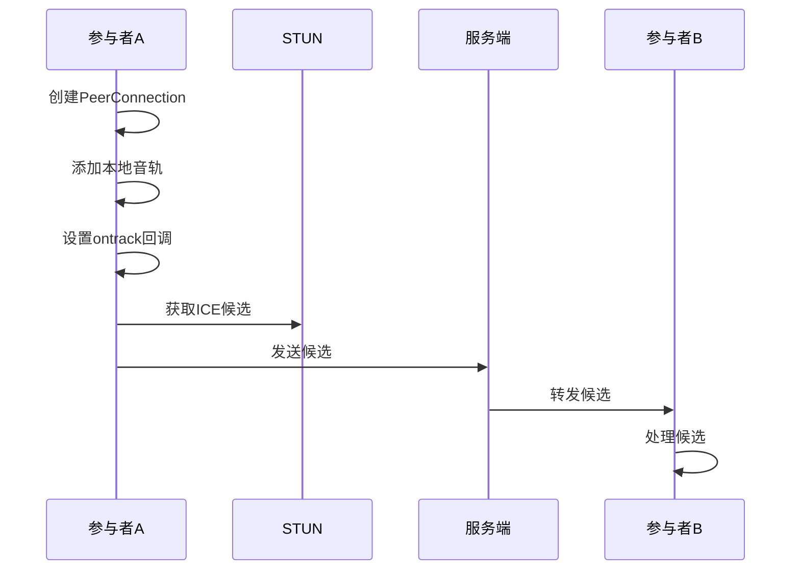
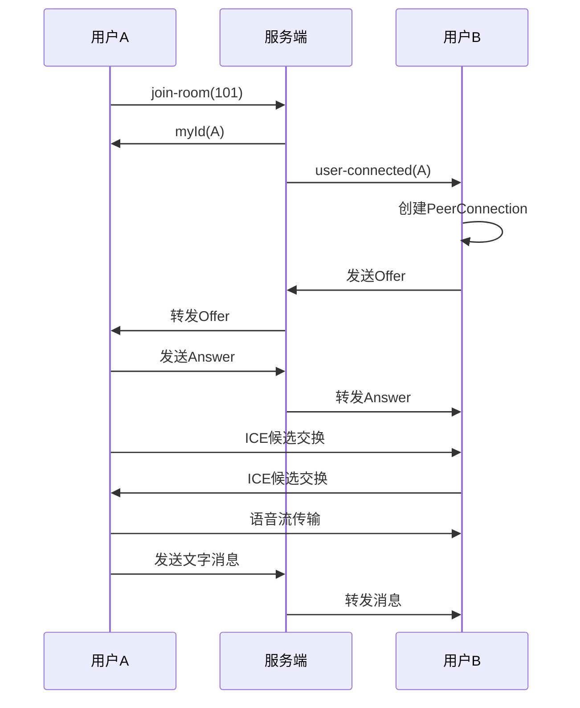

# 基于Socket.IO和WebRTC的实时语音聊天室(Demo版本)

## 功能亮点
- 🎙️ 实时语音通话（P2P直连）
- 💬 文字消息群聊（房间隔离）
- 🚪 动态房间管理
- 🌐 自动NAT穿透（STUN服务）

## 技术栈
| 技术          | 用途                         |
|---------------|------------------------------|
| Socket.IO     | 信令服务器/消息中转           |
| WebRTC        | 音视频P2P通信                |
| React         | 前端界面框架                 |
| Node.js       | 后端服务                     |

---

## 快速开始

### 环境准备
```bash
# 前端依赖
npm install socket.io-client react react-dom

# 后端依赖
npm install express socket.io cors
```

### 代码解析
#### 系统架构图
```
  +----------------+      信令交互       +----------------+
  |  浏览器客户端  | ←—— Socket.IO ——→ |  信令服务器     |
  +----------------+                    +----------------+
        ▲                                   |
        | WebRTC媒体流（P2P直连）            |
        ▼                                   ▼
  +----------------+                    +----------------+
  |  其他客户端     | ←—— WebRTC ————→ |  其他客户端      |
  +----------------+                    +----------------+
```
#### 服务端核心逻辑(server.js)
```js
// 房间管理中间件
io.on('connection', (socket) => {
  socket.on('join-room', (roomId) => {
    socket.join(roomId); // Socket.IO内置房间管理
    socket.to(roomId).emit('user-connected', socket.id);
  });

  // ICE候选转发管道
  socket.on('signal', ({ targetId, signal }) => {
    socket.to(targetId).emit('signal', { senderId: socket.id, signal });
  });
});
```
#### 服务器初始化
```js
const express = require('express');
const http = require('http');
const cors = require('cors');
const app = express();

const server = http.createServer(app);
app.use(cors());
const io = require("socket.io")(server, {
  cors: {
    origin: "*",
    methods: ["GET", "POST"],
  }
});
```
**功能**：创建基础HTTP服务并配置Socket.IO
**关键配置**：
- `cors`中间件用于解决跨域问题，允许任何来源的请求访问服务器
- `origin: "*"`允许任何来源的请求访问服务器
- 指定使用WebSocket传输(默认包含轮询备用)

#### 连接管理
```js
io.on('connection', (socket) => {
  console.log(`用户 ${socket.id} 已连接`);
  
  // 后续事件监听代码...
});
```
**功能**：处理客户端连接事件
**生命周期**：
- 客户端连接时自动触发
- 每个`socket`对象代表一个独立客户端连接
- `socket.id`是自动生成的唯一标识符，用于标识每个客户端连接
#### 房间管理
```js
socket.on('join-room', (roomId) => {
  socket.join(roomId);        // 加入指定房间
  socket.roomId = roomId;     // 存储房间号到socket对象
  socket.emit('myId', socket.id); // 返回客户端ID
  socket.to(roomId).emit('user-connected', socket.id); // 广播新人加入
});
```
**核心方法**：
- `socket.join(roomId)`：Socket.IO内置房间管理。
- `socket.to(roomId).emit()`：向指定房间广播消息
**数据流**：
```
客户端A --join-room--> 服务端
服务端 --> 客户端A：发送myId
服务端 --> 房间其他客户端：发送user-connected
```
#### 信令转发
```js
socket.on('signal', ({ targetId, signal }) => {
  socket.to(targetId).emit('signal', { 
    senderId: socket.id, 
    signal 
  });
});
```
**功能**：中转WebRTC连接信令
**场景**：
- 转发Offer/Answer信令
- 转发ICE候选信令
**路由逻辑**：
```
客户端A --signal--> 服务端 --> 客户端B
```
#### 聊天消息管理
```js
socket.on('chat message', (msg) => {
  io.to(socket.roomId).emit('chat message', msg);
});
```
**广播机制**：
- `io.to(socket.roomId).emit('chat message', msg);`：向指定房间广播消息
- 保证消息仅在房间内传播
#### 断开连接处理
```js
socket.on('disconnect', () => {
  if (socket.roomId) {
    socket.to(socket.roomId).emit('user-disconnected', socket.id);
  }
});
```
**触发场景**：
- 用户主动关闭网页
- 网络断开
- 手动刷新


#### 客户端核心逻辑(App.js)
```js
// WebRTC连接管理器
const createPeerConnection = (targetId) => {
  const pc = new RTCPeerConnection({
    iceServers: [{ 
      urls: 'stun:stun.l.google.com:19302' // Google公共STUN服务器
    }]
  });

  // 添加本地音频轨道
  localStream.getTracks().forEach(track => 
    pc.addTrack(track, localStream)
  );

  // 处理远程音频流
  pc.ontrack = e => {
    remoteAudioRef.current.srcObject = e.streams[0];
    remoteAudioRef.current.play(); // 兼容iOS自动播放限制
  };
};
```
#### 状态管理
```js
const [messages, setMessages] = useState([]); // 消息列表
const [message, setMessage] = useState('');    // 输入框内容
const [myId, setMyId] = useState('');         // 当前用户ID
const [roomId, setRoomId] = useState('');     // 房间号
```
#### 音视频初始化
```js
useEffect(() => {
  navigator.mediaDevices.getUserMedia({ audio: true })
    .then(stream => {
      localAudioRef.current.srcObject = stream;
    });
  // 其他初始化代码...
}, []);
```
**关键API**：
- `getUserMedia`：获取用户媒体（音频/视频）
- `srcObject`：设置媒体流到`<audio>`元素
**注意**：
- 需要HTTPS环境（localhost除外）
- 处理用户拒绝权限情况

#### WebRTC连接管理
```js
const createPeerConnection = (targetId, isInitiator = false) => {
  const pc = new RTCPeerConnection({
    iceServers: [{ urls: 'stun:stun.l.google.com:19302' }]
  });

  // 添加本地音轨
  localAudioRef.current.srcObject.getTracks().forEach(track => {
    pc.addTrack(track, localAudioRef.current.srcObject);
  });

  // 处理远程流
  pc.ontrack = (e) => {
    remoteAudioRef.current.srcObject = e.streams[0];
  };

  // ICE候选处理
  pc.onicecandidate = (e) => {
    if (e.candidate) {
      socket.emit('signal', { targetId, signal: e.candidate.toJSON() });
    }
  };

  // 发起方创建Offer
  if (isInitiator) {
    pc.createOffer()
      .then(offer => pc.setLocalDescription(offer))
      .then(() => {
        socket.emit('signal', { targetId, signal: pc.localDescription });
      });
  }
};
```
**流程解析**：

#### 信令处理
```js
const handleSignal = async ({ senderId, signal }) => {
  if (!peersRef.current[senderId]) {
    createPeerConnection(senderId);
  }
  const pc = peersRef.current[senderId];

  try {
    if (signal.type === 'offer') {
      await pc.setRemoteDescription(signal);
      const answer = await pc.createAnswer();
      await pc.setLocalDescription(answer);
      socket.emit('signal', { targetId: senderId, signal: answer });
    }
    // 处理answer和candidate...
  } catch (err) {
    console.error('信令处理失败:', err);
  }
};
```
**状态转换**：
```
stable -> have-local-offer -> have-remote-offer -> stable
```
#### 用户界面注意
```html
{/* 音频元素 */}
    <audio ref={localAudioRef} autoPlay muted />
    <audio ref={remoteAudioRef} autoPlay />
```
**元素说明**：
- `localAudioRef`：用于显示本地音频流
- `remoteAudioRef`：用于显示远程音频流
- `autoPlay`：自动播放音频流
- `muted`：静音本地音频流


#### 代码细节总结
1. **修改状态的扩展运算符和函数表达式**
在`useEffect`中使用扩展运算符会产生闭包陷阱，因为首次加载时，`messages`数组为空，后续的`setMessages`操作会直接修改一个空的数组，而不会更新状态。因此，使用函数表达式来定义`handleChatMessage`函数，可以避免闭包陷阱。
```js
// 推荐
const handleChatMessage = (msg) => {
      console.log(msg)
      setMessages((prev) => [...prev, msg]);
    };


// 不推荐
const handleChatMessage = (msg) => {
      console.log(msg)
      setMessages([...messages, msg]);
    };
```
2. **每次挂载结束都要断开Socket.IO连接**
如果不断开会导致重复连接，所以每次挂载结束都要断开Socket.IO连接。
```js
return () => {
      socket.off('signal', handleSignal);
      socket.off('user-connected', handleUserConnected);
      socket.off('user-disconnected', handleUserDisconnected);
      socket.off('myId', setMyId);
      socket.off('chat message', handleChatMessage);
    };
```

### 系统流程图


### 使用步骤
1. **启动后端服务：**
```bash
npm run dev
```
1. **启动前端应用：**
```bash
cd part1
npm run dev
```
1. **打开多个浏览器窗口**
访问`http://localhost:5173`，在浏览器中输入房间ID，点击“加入房间”按钮，即可进行实时语音聊天。
1. **功能验证**
说话：能够听到自己的声音
输入文字发送：双方窗口同步显示消息
关闭窗口：对方收到断开通知


### 关键注意事项
1. **麦克风权限问题**
需要在浏览器中允许麦克风权限，否则无法 发送语音。
2. **本地开发限制**
确保Socket.IO服务端配置CORS，允许跨域请求，否则无法正常通信。
3. **NAT穿透问题**
公共STUN服务器可能不稳定

### 常见问题排查
|现象|可能原因|解决方案|
|-|-|-|
无法听到对方声音|	未添加音频轨道|	检查`pc.addTrack`调用
连接状态卡在checking|	ICE候选未交换成功	|检查STUN服务器可用性
文字消息未广播	|未加入相同房间	|验证`join-room`事件处理

### 扩展优化建议
1. 增加房间状态显示：当前房间人数、房间列表等。
2. 优化UI体验：如加载动画、错误提示等。
3. 添加视频聊天功能：使用WebRTC的`createOffer`和`createAnswer`方法实现视频聊天。